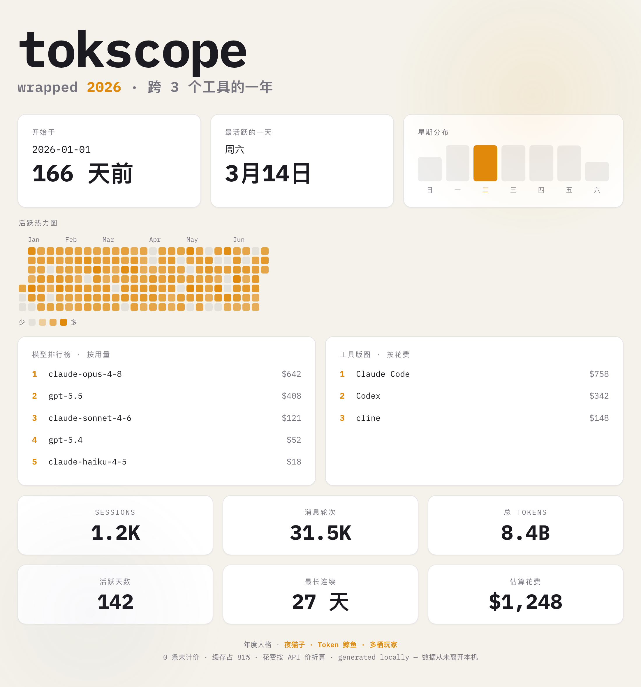

# tokscope

A local, zero-daemon **token-usage recap** for your AI coding tools. tokscope
reads the logs your CLIs already keep on disk, prices them, and renders one
clean, shareable card — part dashboard, part "wrapped". Nothing is uploaded;
your data never leaves your machine.

Inspired by [codex-wrapped](https://github.com/numman-ali/codex-wrapped) and
[opencode-wrapped](https://github.com/moddi3/opencode-wrapped), but aggregates
**across tools** in one card.



## Install & run

No clone, no PyPI — run straight from GitHub with [uv](https://docs.astral.sh/uv/):

```bash
uvx --from "git+https://github.com/HaokaiDing/tokscope" tokscope
```

Or install it as a CLI with pipx:

```bash
pipx install "git+https://github.com/HaokaiDing/tokscope"
tokscope
```

Or clone and run from source:

```bash
git clone https://github.com/HaokaiDing/tokscope && cd tokscope
uv run tokscope                 # opens the card in your browser
uv run tokscope --png           # also export a shareable PNG (needs Chrome)
uv run tokscope --month 2026-06 # just one month
```

Works on macOS, Linux, and Windows.

## Flags
- `--year N` / `--month YYYY-MM` / `--since YYYY-MM-DD` — time window
- `--lang en|zh` — card language (default: from system locale)
- `--png` — also render a 2x shareable PNG next to the HTML (via headless Chrome)
- `--out PATH` — output file (default `out/wrapped-YYYYMMDD.html`)
- `--no-open` — don't auto-open
- `--no-pricing` — skip cost estimation
- `--claude-root` / `--codex-root` / `--cline-root PATH` — override log dirs (`skip` to disable)

## Supported tools

tokscope aggregates tools that persist token usage **locally**:

| Tool | Source | Status |
|---|---|---|
| Claude Code | `~/.claude/projects/**/*.jsonl` | tokens + cache |
| Codex CLI | `~/.codex/sessions/**/rollout-*.jsonl` | tokens + cache |
| Cline (VS Code) | each editor's `globalStorage/saoudrizwan.claude-dev/tasks` | tokens + cache |
| Gemini CLI / OpenCode / Copilot CLI | — | detected, but no local token log to read |

On every run tokscope prints which tools it **detected** vs which actually
**contributed token data**. Tools that don't store usage locally are listed but
can't be aggregated (they'd need their own export).

## Pricing

tokscope ships a bundled price table (a snapshot of
[cc-switch](https://github.com/farion1231/cc-switch)'s community `model_pricing`,
plus a small supplement), so common models are priced **out of the box** — no
setup. If you have cc-switch installed, its live table takes precedence for the
freshest numbers. Subscription/gateway usage is shown as an **API-equivalent
estimate** — real spend is usually lower. Models with no known price are counted
in tokens and labelled "unpriced".

## How it works

```
adapters/*  ->  unified UsageRecord + ActivityPing  ->  stats  ->  one HTML card
(per tool)      (base.py)                               (pure)      (render.py)
```

Add a tool by writing a class with `name`, `available()`, and
`collect() -> (list[UsageRecord], list[ActivityPing])` (see `adapters/base.py`
and `adapters/claude_code.py`), then registering it in `cli.build_adapters`.

The output is a single self-contained HTML file — IBM Plex Mono is embedded, no
CDN, fully offline. Bundled font is IBM Plex Mono (SIL OFL 1.1).

## Privacy

Everything runs locally and on-demand. No daemon, no network, no telemetry. The
generated `out/` files contain your data and are git-ignored.

## License

MIT (c) Haokai Ding
